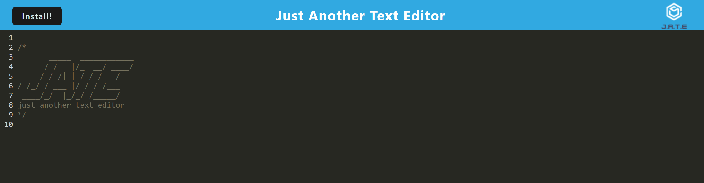

# 19 Progressive-Web-App-Text-Editor

## Motivation

The motivation for this project is to build a text editor that runs in the browser and is a progressive web application. I will be implementing code for the client side of this application as the server-side has been provided already.The web application will have persistent data.

In completing this project, I have learned the basic concepts of utilizing web packages.

### Deployed Link
- https://jate-pwa.herokuapp.com/

## Tools Utilized

  
  

## Table of Contents

- [Motivation](#motivation)

- [Tools-Utilized](#Tools-Utilized)

- [Installation](#installation)

- [Usage](#usage)

- [License](#license)

- [Questions](#questions)

## Installation

User must have access to a web browser. No installations necessary.

## Usage

As a user, you will be able to writ code in the text editor and store/retrive dtata from the database.

## License

  
This application is under the MIT License

### Resources of significance:

 

Special thanks to [Ileriayo Adebiyi](https://github.com/Ileriayo/markdown-badges#testing) for his public library of common badges!

## Questions

Any concerns or questions, please contact me
 

[Cherie Walker](https://github.com/Cherie2)